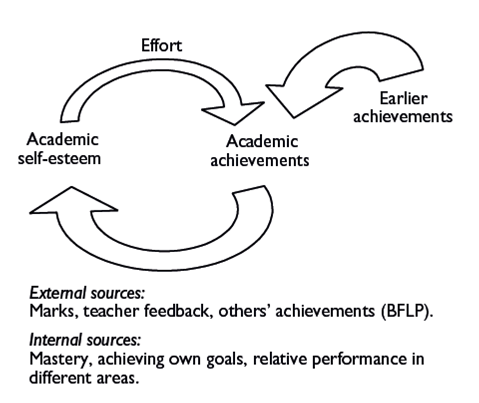
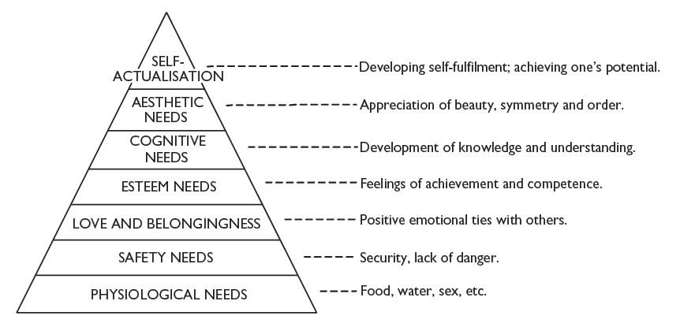

# Treatise on Learning Motivation
2015/9/3

近期因于致力于计科之motivation有感，而作此篇，然其范畴已入学习动机论，不只局限于计科某专门之域也。

Ebrary 为吾校订购之一大外文图书来源，前日余居于乡土，查Physics
Olympiad，即于此站点见数册辅导书籍，且无意间见吾国供给给国际组委会之Chinese
Mathematics
Olympiad试题集，以年代而量之，正为吾人备考此赛事之时也，余见内中有己曾劳神苦思之题目，正如君言，"陌生且熟悉"之感，然言此不过见此站点收书之广，且有大量非学术类之电子图书也。

于学习动机论一主题，前日余有读某版本之Psychology of
Education，其中于此题有数十页之阐述。盖其论各家之精要，亦非自创一说也。然此书多于Pupils之教育法举例。而青年之学习动机，与children
亦有所别，故余仅取其中普遍原理者转述且发挥之。心学大师Bruner有学校之formal
education decontextualised 一说，即谓 learning occurs separately from
the actual thing or process that is being studied and therefore requires
specific and conscious effort to maintain involvement。Formal education
提高知识传递效率与脱离知识产生之具体语境相伴随，此种情况之发生，可引杜威之言：the
education which everyone gets from living with others . . . and the
deliberate educating of the young. . . . Savage groups . . . have no
special devices, materials, or institutions for teaching save in

connection with initiation ceremonies by which the youth are inducted
into full social membership.. . . To savages, it would seem preposterous
to seek out a place where nothing but learning was going on in order
that one might learn. But as civilization advances, the gap between the
capacities of the young and the concerns of adults widens. Learning by
direct sharing in the pursuits of grown-ups becomes increasingly
difficult.正因此种formal education
之特点，learners须有特别之动机方有持恒之效，以致成学之功。此为今日学习动机论不可不讲之因也。

学习动机往往不可置于所学之内容本身而言之，而恒出于他者：外部性倾向明显的理论，有John
Atkinson 的成就论（achievement motivation），Weiner之归因论(attribution
motivation).成就论以获得成功与避免失败二途论学习动机，以余人之学习阶段而言之，可由致力拿满分与避免挂科而解释学习动机；至于归因论，则为learner自身对学习结果的阐释，有Ability
and Intelligence; External factors like the task difficulty;
Controllability
如所付出的努力，此为Weiner划分之三类原因，为learner用来解释自身学习现状的主要范畴，且从此解释范畴可窥测learner学习动机，以余人之学习阶段（包括已历之中学教育）而言之，往往于考试后作此归因之事，而此中似有形成正负循环之可能。

至于内部性倾向明显之理论，有最流行之Self-determination
theory,基于环境而形成的Academic Self-Concept
Theory,人文色彩很重的需求理论，重视学习过程之Flow及Task
Involvement理论，以及以此理论为基石的Play (study for fun)理论。

Self-determination theory 为Ryan 和
Deci所创，其所重视之处在于外部激励向内部激励转化的学习过程(from
extrinsic motivation to intrinsic
motivation)，而内部激励较之外部激励之更为有效可由一经典实验明之：

Lepper *et al.* (1973) carried out a classic investigation into the
effects of extrinsic motivators on natural learning in a study of
children's drawing activities. First they observed a group of
nursery-school children in a free-play period to see how much time they
spent on drawing. They chose a number of children who seemed to like
drawing and split them into three groups which subsequently had
different expectations and experiences of reinforcement. Only one of the
groups was told that they would get a 'good player' award for making
drawings, and then all three

groups were allowed to 'play' with some drawing materials. After this
session, the reward was given to the group that expected it, and a
reward was also given to the children in one of the other groups, who
did not expect one.There was therefore one group of children remaining
who did not expect, and were not given, a reward.

All three groups were then allowed a further free-play session, during
which they were observed to see how much time they spontaneously spent
on drawing activities. The key finding was that children in the group
that had been promised and then received a reward now spent less time
than the other two groups on drawing. Lepper *et* *al.* interpreted
these results as indicating that the children who had expected a reward
had come to use this as a reason to justify why they were involved in
drawing. When the reward stopped, then there was no longer any reason to
continue with the drawing; the children's sense of personal control or
involvement with the task itself had been removed and drawing was an
activity they did only to get something
else.（余认为此实验似表明外部激励有可能会有负作用）

余人皆知心学著名之糖果公案，（探究自控力与智力的关系）引述：In one of
the most famous experiments in the history of psychology, Walter Mischel
and his students exposed four-year-old children to a cruel dilemma. They
were given a choice between a small reward (one Oreo), which they could
have at any time, or a larger reward (two cookies) for which they had to
wait 15 minutes under difficult conditions. They were to remain alone in
a room, facing a desk with two objects: a single cookie and a bell that
the child could ring at any time to call in the experimenter and
receiven oand recei the one cookie. As the experiment was described:
"There were no toys, books, pictures, or other potentially distracting
items in the room. The experimenter left the room and did not return
until 15 min had passed or the child had rung the bell, eaten the
rewards, stood up, or shown any signs of distress."The children were
watched through a one-way mirror, and the film that shows their behavior
during the waiting time always has the audience roaring in laughter.
About half the children managed the feat of waiting for 15 minutes,
mainly by keeping their attention away from the tempting reward. Ten or
fifteen years later, a large gap had opened between those who had
resisted temptation and those who had not. The resisters had higher
measures of executive control in cognitive tasks, and especially the
ability to reallocate their attention effectively. As young adults, they
were less likely to take drugs. A significant difference in intellectual
aptitude emerged: the children who had shown more self-control as
four-year-olds had substantially higher scores on tests of intelligence.

盖此两案皆以children为实验对象，而明心学之相关原理也。

关于Academic Self Concept
Theory,可解释很多学习行为动机，如学习者在不同领域被激励程度有别，Big-Fish-Little-Pond-Effect,及学习者往往要通过与co-learners进行比较产生self-concept,进而影响学习动机，因此low-
or medium-ability students might prefer to attend a low-ability school
instead of a high-ability school, as this would be better for their
self-concept. 不知这对于痴心给孩子转学到more advanced middle
school的父母有无启发。

此理论还有关于学习者对自身能力（self-efficacy）的把握会影响学习动机的论述，而把握的资料来源往往是学习者过去的经历，这与归因论有相似之处，可用如下之示意图明此良性cycle:

{width="4.95in" height="4.158333333333333in"}

关于需求理论，为Moslow
所创，其内涵甚广，而其某些方面于教育领域比较适用，故余初中时即对此理论有所耳闻，大体而言之，其分人之需要为若干等，以生理、安全等需要居于末等，然亦是金字塔之底层，最高层为自我实现的需要，且必须下面的层均充实方可构筑上面的层，其人理论图见下：

{width="5.758333333333334in"
height="2.7666666666666666in"}

此理论似可作为保障基本的生活条件才可谈学习动机等事情的理论基础。

关于Flow 与 Task Involvement
之理论，描述在学习过程中出现的高潮是一种intrinsically motivating
的过程，学习者比较明显的感觉有lose track of time, and even
space。此种状态下学习者比较乐于接受稍微超出能力范畴的挑战，且如果能克服，可以得到正面的情感体验。此理论为认知发展的理论体系一部分，而我认为认识科学区别于行为科学就在于它强调学习的过程而不是学习的结果。此方面最重要的人物要数理论家Piaget和实践家Montessori.且基于Piagetian
theory,即使在Flow状态下所接收的内容也不可远远超出能力范畴，否则学习者就会因无法对付而降低参与感。Montessori的教育实践虽然是成功地教会了一批残障儿童，但却对认知科学的发展做出了重大贡献（今天很多儿童玩具如搭积木就是根据她的理念设计的）。

因为我看到的书对Play and Learning
讲的较少，如仅提到Play中的体验与学习过程中Flow很像，关于Play
在儿童教育中的作用，有这样的论述：Play also appears to be important in
the development and mastery of skills. Hutt in an early study(1976)
described the role of curiosity and exploration in young children's
mastery of a novel toy. Children who were more active in this process
subsequently showed better long-term

development in a number of other areas, indicating that the earlier
experiences of play formed a foundation for later, more formal
skills.且今世最早期的儿童教育主要是通过此途径实现，但是学校里的 formal
schooling tends to restrict the focus on play to early-years education,
largely because of the need to develop certain skills such as reading or
number work. Such formal skills cannot be developed by normal play
experiences and need a considerable level of
direction.（下面是我个人的发挥了）根据上面的观点，Play的局限性在于，很多现代生活很重要的东西（如literacy
和
numeracy（算术）），单通过play是很难学会的，更准确的说，是很难学好的（虽然现在基于科学原理开发了很多这方面的产品，比如趣味性的图片书、玩具等等，但最主要，最正规也是最系统的方式仍是通过学校里的formal
education来完成。但formal
education并没有彻底否定掉P此类lay的作用，事实上，如果学习者对所学内容之前毫无接触的话（学习内容如numeracy,虽然考虑到目前学前教育的发达程度，这种假设不太可能），那么仅指望formal
education来达到master的程度，是不现实的。当然，由于formal
education本身的设计是科学的,在理论上总可以掌握所学的全部内容，但联系我们的学习实际可知，这种掌握往往是转瞬即逝的，即过了这一个学习阶段就忘掉了。这是针对所学内容仅仅发生在formal
education的范域的描述。当然，我们也不得不承认它巨大的Legacy,就是大家常说的，我以前系统的学过的东西，给我一点时间，我能很快捡起来。当然，捡起来本身不是目的，往往是根据其他方面的需要才捡起以前学过的东西，而且往往没有必要全捡，只是取其中一部分罢了。比如，之前我在学物理的多自由度的简谐振动一节，就要对线性代数中特征值与特征向量的知识较熟悉；最近要看图形编程所需要的空间坐标变换，所用的数学工具还是线性代数中低维矩阵的运算，但即使是这样，不过取出之前学线性代数一点皮毛罢了，我再翻开自己的线代课本，"陌生且熟悉"，陌生的是基于空间分解理论的证明体系，熟悉的是各种实用的线代运算。

像Numeracy这类内容，也许Play可以起到重要的辅助作用，即让学习者提前对此比较熟悉，在之后的娱乐生活中进一步熟悉，但Numeracy之所以成为现代人人必备的技能之一，确不是play建立起来的，而是它的实用性（practicability）。食堂窗口的工作人员自不用说，算得比我们都快，日用之间，几乎离它不得。算一下上课时间与起床时间的时间差等等（现代社会的时间观念是Numeracy一大练习场域），以致于运用这种技能已经成为一种不自觉的事。如果我们回想一下当初学算术时教科书设置的各种实际背景的话，发现它们既源于生活，又不像生活。小明于某时从某地出发，以某速行驶某程，问到达时间？我们在现实中是否做过这样的计算呢？往往因为已知条件不清楚而不做，即使像火车这样的情况，直接查到站时间表就可以了，有人帮你算好了，何况中途停站时间一般人也难以估算准确。相反，关于其他的生活场景我们却不自觉地做了大量的mental
accounting,
比如制订个人学习计划，有可能精确到分钟，会通过算术的工具来求出各领域分配的时间长度等等，但我们却很少见到教科书会举这样复杂的例子。说它复杂是相对于我们学算术的年龄，如何理解这样的背景的确是个难题，这也正好说明了学线代时举什么样的例子是合适的。没错，它作为工具是在各领域有很多应用，但要初学者去理解大部分应用就像要求小学生去理解(准)成人用算术的工具做TimeTable一样，尽管工具上可能没有区别，但属于非工具的因素足以致人于五里雾中，不是所有学过线代的人就可以马上理解多自由度的简谐振动，学线代的阶段可能连一维的简谐振动都不清不楚；也不是所有学过线代的learner就可以马上弄明白平面和空间的Transformation，要用线代的思维对初中非常heuristic讲解的图形变换进行深造是要有一个过程的。本来基于高中讲解的平面、空间向量是可以在中间做一个过渡的，但高中教科书必修没有系统地这样做出，结果各种良莠不齐的教辅乘虚而入，确实有误人子弟之效。但是目前高中新课标4系列有一薄册叫矩阵与变换，只讲二阶矩阵的各种Transformation，共分三章，第一章介绍二阶矩阵的基本知识及图形变换，第二章讲用二阶矩阵的方法解一元二次方程组，个人觉得写得较啰嗦，但比较严谨，穷尽各种特殊情况，可以用来设计算法，在计算机上编程实现（PS：必修三第一章本来是教大家用Basic编程的，结果因当时我们什么都不懂，也不知道用计算机课的时间进行练习，致使操作课上成用纸写程序的课。事实上，算法与程序框图是典型的计算机思维，在学生不能实际操作体验瞬间算出1\^n+2\^n+...+m\^n结果的情况下，一切的训练都是？，话说回来，听父亲和基能老师说，他接受职业教育时还是用纸写Basic
程序。看来这是个历史问题。）第三章讲二阶矩阵的特征值与特征向量，最后一节给出了应用，即求一个二阶矩阵的n次方，用来解决某种实际问题：两数列的递推公式线性耦合。（PS：我当时看到的数学竞赛书上有这种解两数列的递推公式线性耦合的题目，但解答很不客气地用上面特征值的思想只留下一堆运算表达式，令自学读者费解的是其背后的理论基础：为什么这样"凑"恰好得到二个等比数列？目前尽管我对这方面好久没接触了，但知道它所属的数学领域为差分方程，给我的总体印象就是这方面用来开发智力比较合适，因其处理离散系统，其应用远逊色于微分方程。但也许随着计科方面的深入我的观点会变化...）我是在高二的时候看了这本《矩阵与变换》的，当时虽然读通了，但不知道它在讲什么，直到最近接触到了Computer
Graphics
才知道一二，相比较而言，专门计科教科书中借用的这方面的知识和这本书是差不多的，不过如果高中数学不强调任何算法与计算机思维的话，读这本书在当时的背景下没有丝毫用处，但因为当时自学过，现在捡起来\-\--或者说，看图形编程的书数学理论部分可以比较快。

用了一大段讨论某一专门之域Self-Instruction的承接经历，其中确实有一定巧合，但从我个人对几何的感觉上来说，也有合理之处。前段时间一直觉得过去所孜孜于Classical平几与立几在现代数学潮流中成为无人关注的小草。这话对也不对。对的是证明的体系变了，中学所学和我当时self-instruction的advanced
内容大部分被废掉了。只有一些基本的性质拿来辅助说明代数的结论。而不对的是，处理的基本对象没有变，不考虑代数抽象的各种成果，研究的还是圆、直线这些内容，至少高中解析几何的基本内容延续下来了，至于那些压轴题，确实是吾国命题专家思想的结晶，和今后的应用没有关系。抛开考试论不说，针对几何上做的大量的练习题并不能帮助一个理工科的学习者更好地理解问题的内容，因为除了具体领域所用的数学工具以外还有各种实际的能力是我们非常欠缺的，比如前段时间读Lagrange力学，物理所用的数学当然是一个难点，但还有一大困难是如何将问题用物理规律描述出来（我的Lagrangian常常写不出来或写错）。过去我们花了太多时间训练本来已经非常熟悉的内容，结果发现在短短的大学时光中除数学外各个方面都有欠缺（高中物理因体系不完备，貌似是物理教育专家的杰作，其描述手段不符合现代物理的准则，因此虽然结果没有明显错误，但无法真正体现出一个Discipline（有"纪律"）
应有的东西，高中新课标其中最受专业人士诟病的是矢量不加箭头，大大误人子弟，甚者学过大物仍延用"矢量方向在心中，列式只有加减乘。"一年前我即如此，一直认为这样很方便，全部改写成标量方程，但...再发两句牢骚，德国高中实行3选1的方法，物化生只要专修一门就够了，必考的四科为母语、法语、英语和数学，且数学题目也不会像我们玩那么多花样，只有解答题（前段时间我从德国最大的教育资源网找题目做了一下），因此如果采用类比法的话，为什么我们不能通过普及日语教育促进睦邻友好与理综（Integrated
Science）三选一的方法减轻理科学生负担？当然这些论述完全忽视了教育学的其他方面，后文会稍微提及一下，因此不过发发牢骚而已。）

我的这次讨论不触及考试论和语言教学论（母语与英语），而批评中学的过量formal训练与实际所须之数理严重脱轨，而真正有用的技术（如Computer
Science）受教育程度又很低，但无论如何，数理中一些关键之处中学教育还是提供了的。在这些关键之处上稍过量的练习也许不是一件非常过分的事，也许今天我们才要感叹练习偏少的困境。这些关键之处构成了理工科技术人员共同的知识基础。当然，仅有高中那一点还远远不够，需要把大学里公共数理课程和程序设计基础加起来，作为进一步前进的阶梯。由于熟练地使用这些工具和个人职业发展有密切的联系，因此根据前面关于学习动机的讨论，我们总有足够的理由和机会来熟悉其中的技术。但另一方面，或者说是数理一个不很显著的方面，在于Play
对数理学习的作用上。

前面提到主题相关的play对儿童Numeracy的影响，这是一个高度市场化的领域，直接消费对象却是广大家长，造成的结果是,似乎play
with
识字图等，儿童不会主动参与或独立认知有困难，而须有家长的指导。待儿童年岁稍长，则往往与peers相追逐，亦是习得各种娱乐方式之关键时期，再长则难矣。然一人有某种爱好，余非谓其将一成不变与此一人相始终，必与他科相交融相感而有新事物以生，余前日作《论吾国博戏》（已寄君），即论李清照以历史学家之关照写博戏史，而西方则用数学方法研究致胜策略也，若有马克思主义者出于其中，必曰：此为二地经济基础不同所致也，盖欧洲此时资本主义方兴...故其人借博戏之微观世界成一社会学著作也，若有如今日计科之专家见之，则必致力于算法设计，以成超强之计算机对手也。凡此诸学，皆有以与博戏相交之处，而所交必有新事物以生也。然交之前提者，必此专家或学者少时有对此种博戏之爱好，即长，方可不愿泥古而亦不可于旧有之方向完全弃之（因余略懂象棋，知泥古在于叙棋谱以古法，如有马三进六
此种说法。）然不愿泥古必有当日谙熟于古道，如新文化之运动者所以成文化创新之功者，即在此辈人欲更新个人平生所学之封建学问也。此种觉悟犹难，承认过去之知识基础几成废纸，仅可作借鉴类比，不可为人生指南，而于新知识与思想如饥似渴者，则余辈当法百年前之中国青年也。

社科书之繁杂，新近之理论往往标名目为于旧有之表述改进或推翻，观Wikipedia条目亦常设Criticism一栏，可见各派于同一问题之众说纷纭。虽然，若辩章学术，考镜源流，则新近之理论，岂均为于旧有之体系改进且推翻哉？抑或仅借旧有之理论以回答时代问题者乎？此种区别，正为进化论与演化论之分野，为余人读书所宜深辨。行为经济学为后出，然未有古典之经济人之理性假设，则必不能将心理因素纳于分析范围也。教育史学为晚进，然未有普及之mass
education，则教育史学亦不传统之教育哲学史也（即只写教育家的教育思想，而这个教育家的头衔，往往是给少数精英讲学而获得的。吾人今日读书，往往喜新而厌旧，觉古典政治经济学与教育哲学史之陈腐，此为人之常情，而此两学问亦为学科已分化但未充分细化之前宏观讨论某一领域社会现象之学问也，因其需各端皆及，故不能有具体而微之研究之所长，然在当时，亦为学术范式，且新学问舍此亦无父，亦无母也。焉有爱其子而诋其父母之理？

至于数理诸学，则诚有进化线索可言也，今日写经典力学之书，皆有Newtonian
Formularism 一章，然其所讲之Newtonian Mechanics, 虽于核心观点与Newton
同，然其旁及之守恒定律（如角动量守恒之晚出）与经典之问题（如火箭发射），则非Newton之时代所可及也。故吾人居今，不必苦读Newton's划时代巨作Principia,
因此书必后世无数力学之书所超越，而今世之数理，又可赖计算机之助而又有一番面貌，而苦读Principia之辈学者，非数理技术人员，因其入科技史之领域也。

以上两段虽论社科与数理之异同，要之两科必有独特之处以吸引青少年定向于此，余前日有读一论如何提高
