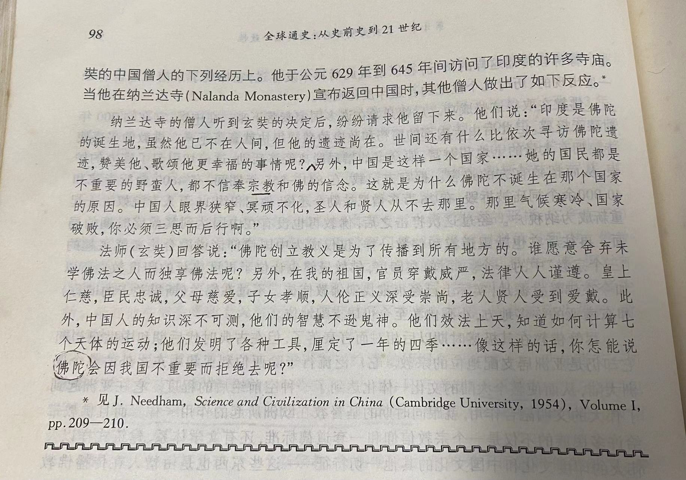
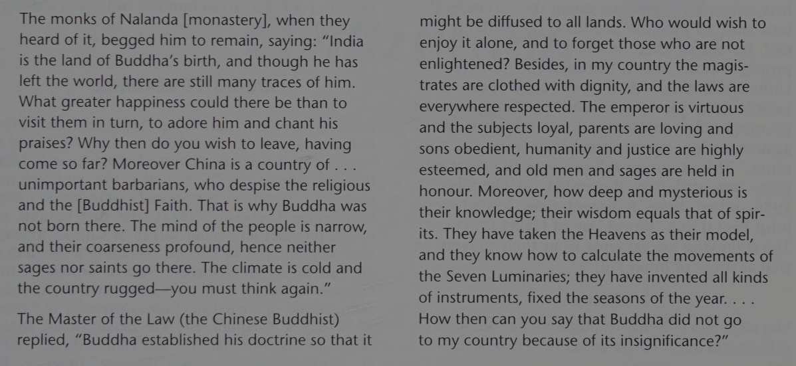

Chapter 3

马克思主义唯物史观也认为人口过剩对土地的压力是导致
战争的深层次原因。

《平凡的世界》中孙少平当短工时出的力也不少，可
孙也算半个读书人了，他的命运咋难出人头地呢？成长
环境没有限制他的眼界，但限制了他的机遇。

男主外女主内的模式，是各大古文明共同的特点。

中国的《九章算术》也有很多这种问题。

Mesopotamina 版本的父母之命

应使用“那烂陀寺”这个译名，在《大慈恩寺三藏法师传》中出现过。

关于这两段关于玄藏与僧人的对话，白话文翻译存在诸多问题。
我觉得这主要是从英文转译，而不是从文言文翻译的结果。
对话原文如下（出自《法师传》）：

法师即作还意，庄严经像。诸德闻之，咸来劝住，曰：“印度者，佛生之处。大圣虽迁，遗踪具在，巡游礼赞，足预平生，何为至斯而更舍也？又支那国者，蔑戾车地，轻人贱法，诸佛所以不生，志狭垢深，圣贤由兹弗往，气寒土崄，亦焉足念哉！”法师报曰：“法王立教，义尚流通，岂有自得沾心而遗未悟。且彼国衣冠济济，法度可遵，君圣臣忠，父慈子孝，贵仁贵义，尚齿尚贤。加以识洞幽微，智与神契。体天作则，七耀无以隐其文；设器分时，六律不能韬其管。故能驱役飞走，感致鬼神，消息阴阳，利安万物。自佛遗法东被，咸重大乘，定水澄明，戒香芬馥。发心造行，愿与十地齐功，敛掌熏修，以至三身为极。向蒙大圣降灵，亲麾法化，耳承妙说，目击金容，并辔长途，未可知也，岂得称佛不往，遂可轻哉！”

英文相关段落为：

兹列举几处误译并加以分析：

“何为至斯而更舍也？” 在英译中为 "Why then do you wish to leave, having come so far?"，在白话文中缺失。

“贱法” 在英译中被增译为 "despise the religious and the Buddhist Faith"，未必妥当。

“岂得称佛不往，遂可轻哉” 主语是 “诸德轻支那国”，
在英译中主语错误，白话文因之。

也有精彩的地方：

圣贤经过“sages and saints”的转译在白话文中变为
“圣人与贤人”，符合原意。

七耀（指日月五星）-> seven luminaries -> 七个天体

此外，我和鑫熠还讨论了关于本书中译本的几个插曲。

首先上面关于佛教传播的讨论这个例子来自李约瑟的中国科学技术史。李本身也是从别人翻译的《法师传》引过来的，看李的注释感觉英的节译本《法师传》是从法译本过来的，这个我没有仔细考证。

《全球通史》的中译本04年拿到版权，05年出第一版，06年小修
小改出第二版，估计只改了一些标点排版之类的地方。比如第4章里“更广泛和更有影响”变成“更广泛、更有影响”。
但书的译者加2减1。鑫熠推测内部意见不统一，有才但比较年轻的被“踢”出去了。

